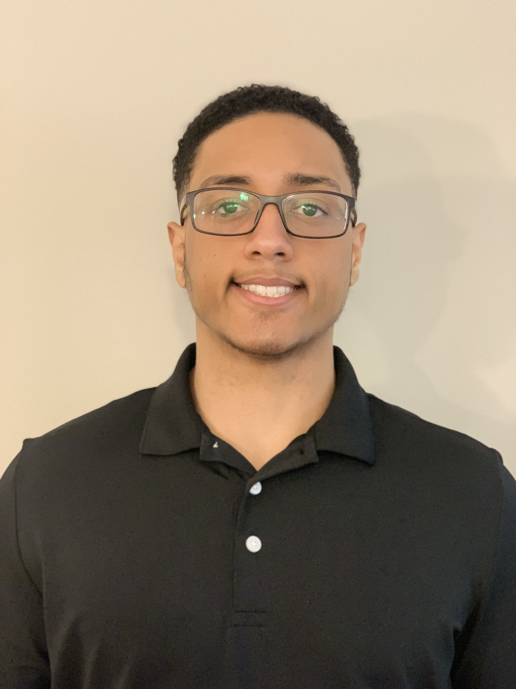

About Me
 
## Matt Nova
 
<body>

![Matt]
  

 

Hi, my name is Matt! I'm a Junior Software Engineering student at Quinnipiac University, I'm also pursing a minor in Applied Statistics and Data Science. I got into this field of study because I'm innovative, driven by problem solving, and I love to create. Outside of school I enjoy working at Over The Top Athlete Performance Center where I work part-time as a Fitness Trainer leading large group classes and mentoring dedicated athletes.
</body>
